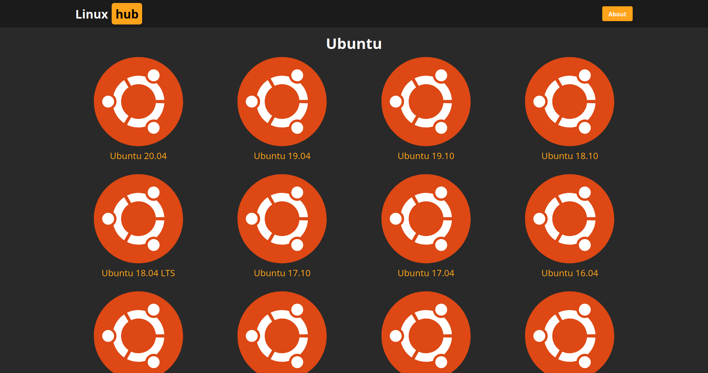

# LinuxHub

Explore Linux distros and their versions.

See the READMEs in the linuxhub-api and linuxhub-www subprojects for more information.

## Screenshots

## Container

When running the containers, as documented in subproject READMEs, make sure the `linuxhub` pod exists.

`podman pod create --name linuxhub -p 8080:80 -p 8000:8000`

Running `podman-compose.sh` will automate building the containers and starting them in a pod.